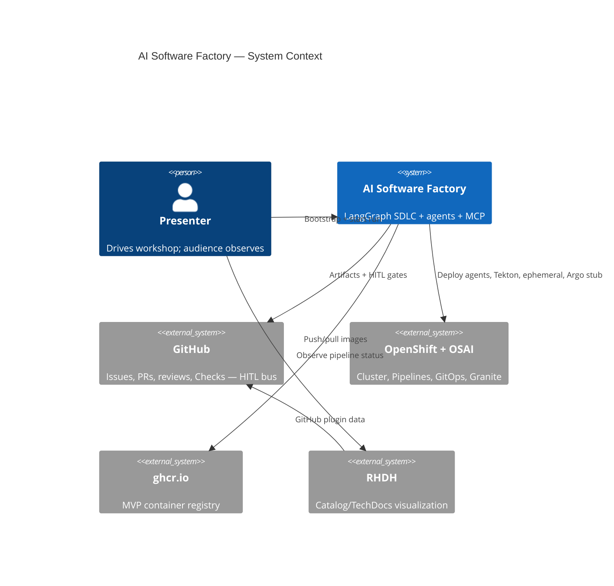
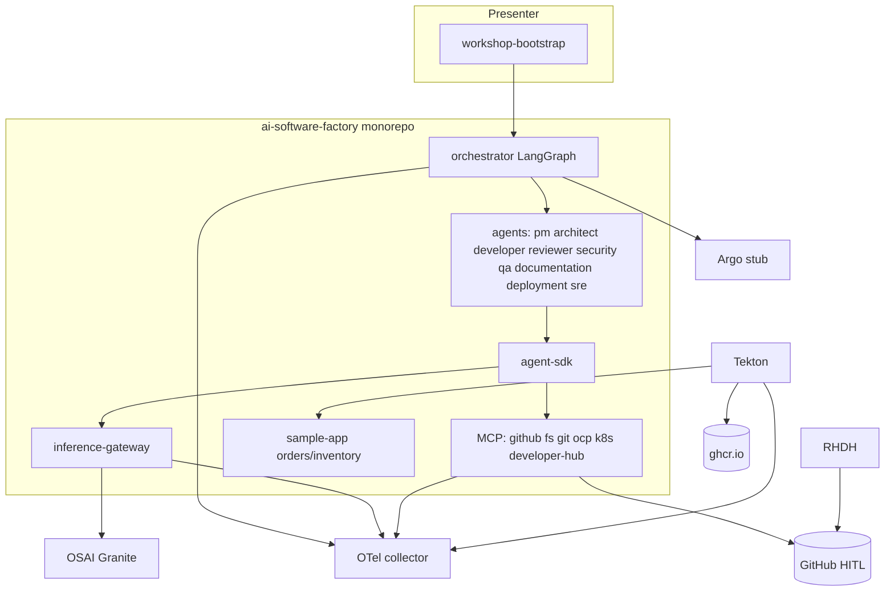

# Architecture overview (C4 summary)

English C4-oriented summary of the AI Software Factory workshop MVP.  
Canonical Engram companions: design `sdd/ai-software-factory/design`, diagrams `sdd/ai-software-factory/design-diagrams`, ADR mirrors under [`adr/`](./adr/README.md).

## C4 L1 — System context

## Containers / components

## Happy path (sequence)

Issue → PM → Architect → **GitHub HITL** → Developer → PR → Reviewer → Tekton → ghcr.io → ephemeral URL → GitOps promote **HITL** → Argo stub → SRE notes.

## Live Granite vs emergency fallback

Default: agents → `packages/inference-gateway` → live OSAI/Granite.  
Emergency-only: `INFERENCE_FALLBACK=true` after retries; response + OTel `workshop.fallback` / `inference.fallback=true`. See [inference fallback](../workshop/inference-fallback.md).

## Ephemeral lifecycle

Tekton creates `NAMESPACE_PREFIX*` ns, deploys Helm sample-app, comments URL on PR; teardown via [`scripts/teardown-ephemeral.sh`](../../scripts/teardown-ephemeral.sh) and [teardown runbook](../workshop/teardown.md).

## Related diagrams

Full Mermaid set lives in Engram `sdd/ai-software-factory/design-diagrams` (C4, fallback sequence, ephemeral destroy).
